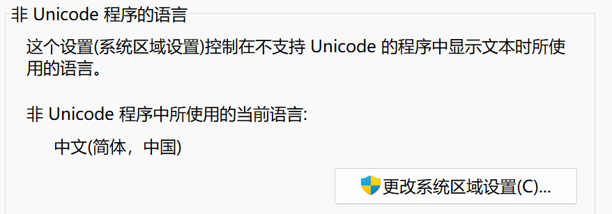

# XCPC templates by Komorebie

### 使用须知
**Windows**
- 首先保证你的电脑上已经安装了 texlive 套件（即 latex 环境），如果没有请自行下载安装。
- 将电脑的编码格式设置为 UTF-8，否则可能会出现乱码。设置->时间和语言->管理语言设置勾选 Beta: 使用 Unicode UTF-8 提供全球语言支持。
- 关于config文件的使用：
    - 每一级目录下都可以有一个 config 文件，用于组织该目录下的所有文件。
    - config 中的每一行对应一个文件或文件夹，文件名和文件路径之间用空格隔开。当你想在当前目录中引入文件夹时，config 中应该增加一行：<小节名称> <> <> <文件夹路径>；当你想在当前目录中引入文件时，config中应该增加一行：<小节名称> <文件名.cpp> <文件名.tex>，如果没有对应的 .tex 文件，可以将第三个参数留空，即：<小节名称> <文件名.cpp>。